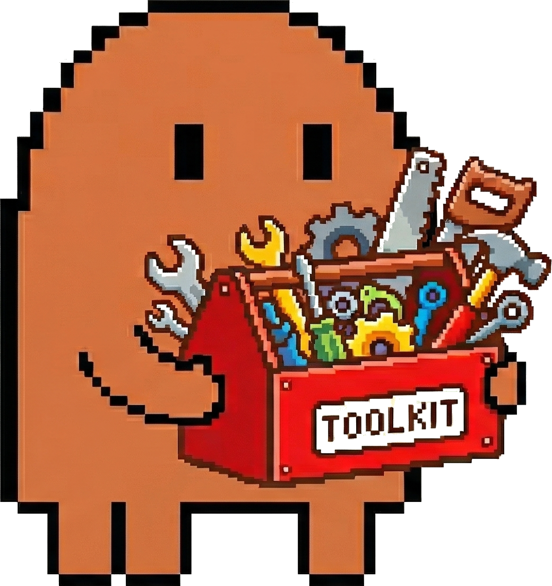

<p align="center">
  
  <br><br>
  
  <br>
  
  
  
</p>

# claude-toolkit

A portable collection of [slash commands](https://docs.anthropic.com/en/docs/claude-code/slash-commands) and [skills](https://docs.anthropic.com/en/docs/claude-code/skills) for Claude Code that sync across machines via git. Clone, install, and every Claude Code session picks them up immediately.

```bash
git clone https://github.com/Maninae/claude-toolkit.git ~/Developer/claude-toolkit
cd ~/Developer/claude-toolkit && ./install.sh
```

The installer symlinks everything into `~/.claude/`. Your existing local commands and skills stay untouched.

---

## Commands

Slash commands you invoke directly in a session.

| Command | What it does |
|---------|-------------|
| `/cc` | Check current context token usage |
| `/commit` | Generate a commit message from staged changes and commit |
| `/gmp` | Stage, commit, and push in one shot |
| `/grill` | Interview you to eliminate ambiguity before starting work |
| `/push` | Push commits to `origin/main` |
| `/resume` | Read the last session history to pick up where you left off |
| `/sync-claude-toolkit` | Detect new local skills/commands, copy into repo, commit, push |
| `/teach` | Guidelines for writing educational Jupyter notebooks |
| `/trawl` | Deep context exploration of the codebase for the current task |
| `/wrapup` | Document the session into project history |

## Skills

Skills load automatically when Claude Code detects a matching task context. Grouped by domain:

### Architecture & Engineering

| Skill | Domain |
|-------|--------|
| `senior-architect` | System design, architecture diagrams, tech stack decisions |
| `senior-fullstack` | Fullstack scaffolding, code quality, project setup |
| `systematic-debugging` | Root-cause analysis before proposing fixes |
| `verification-before-completion` | Verify with real output before claiming done |

### Frontend & UI

| Skill | Domain |
|-------|--------|
| `frontend-dev-guidelines` | React/TypeScript patterns, MUI v7, TanStack Router |
| `react-best-practices` | Vercel's performance rules for React and Next.js |
| `ui-ux-pro-max` | Design intelligence across 50 styles, 21 palettes, 9 stacks |
| `core-components` | Design system tokens and component library patterns |
| `canvas-design` | Original visual art for posters, graphics, designs |

### Planning & Execution

| Skill | Domain |
|-------|--------|
| `writing-plans` | Turn a spec into an implementation plan before writing code |
| `planning-with-files` | Persistent file-based planning for complex research tasks |
| `executing-plans` | Execute a written plan with review checkpoints between batches |
| `dispatching-parallel-agents` | Parallelize independent tasks across subagents |
| `subagent-driven-development` | Execute plan tasks sequentially with per-task review |

### Languages & Runtimes

| Skill | Domain |
|-------|--------|
| `javascript-mastery` | 33+ JS concepts from fundamentals through advanced patterns |
| `bun-development` | Bun runtime, bundling, testing, Node.js migration |

### Testing & Automation

| Skill | Domain |
|-------|--------|
| `playwright-skill` | Browser automation — forms, screenshots, responsive checks |
| `webapp-testing` | Python Playwright toolkit for local web app testing |

### Tooling & Infrastructure

| Skill | Domain |
|-------|--------|
| `mcp-builder` | Build MCP servers in Python or TypeScript |
| `autonomous-agent-patterns` | Design patterns for building autonomous coding agents |
| `file-organizer` | Deduplicate and restructure directories intelligently |
| `app-store-optimization` | ASO research, keyword analysis, metadata optimization |

### Writing & Education

| Skill | Domain |
|-------|--------|
| `write-like-human` | Cut AI-sounding prose while keeping a clear, professorial voice |

### Rules (always-on)

| Skill | Purpose |
|-------|---------|
| `never-use-rm` | Safety rail against destructive `rm` commands |
| `xcode` | Xcode project conventions |

---

## How it works

```
~/Developer/claude-toolkit/           ~/.claude/
├── commands/                         ├── commands/
│   ├── gmp.md           ─symlink─▶  │   ├── gmp.md
│   ├── commit.md        ─symlink─▶  │   ├── commit.md
│   └── ...                           │   └── ...
├── skills/                           ├── skills/
│   ├── senior-architect/ ─symlink─▶  │   ├── senior-architect/
│   └── ...                           │   └── ...
└── install.sh                        └── (local-only items untouched)
```

`install.sh` creates symlinks from `~/.claude` into this repo. If a file already exists and isn't a symlink, it gets skipped — nothing is overwritten.

`/sync-claude-toolkit` works in the other direction: finds real (non-symlinked) files in `~/.claude` that aren't in the repo, copies them in, replaces the originals with symlinks, and pushes.

## Syncing across machines

Created a new skill on your laptop? Push it to the repo:

```
/sync-claude-toolkit
```

Pull it on your other machines:

```bash
cd ~/Developer/claude-toolkit && git pull && ./install.sh
```

## Adding new items

**Command** — drop a markdown file in `commands/`:

```markdown
---
description: What the command does
---

# Instructions for Claude when this command runs
```

**Skill** — create a directory in `skills/` with a `SKILL.md`:

```markdown
---
name: my-skill
description: When Claude should activate this skill
---

# Domain knowledge and behavioral instructions
```

Or create them anywhere in `~/.claude` and run `/sync-claude-toolkit` to pull them into the repo automatically.
