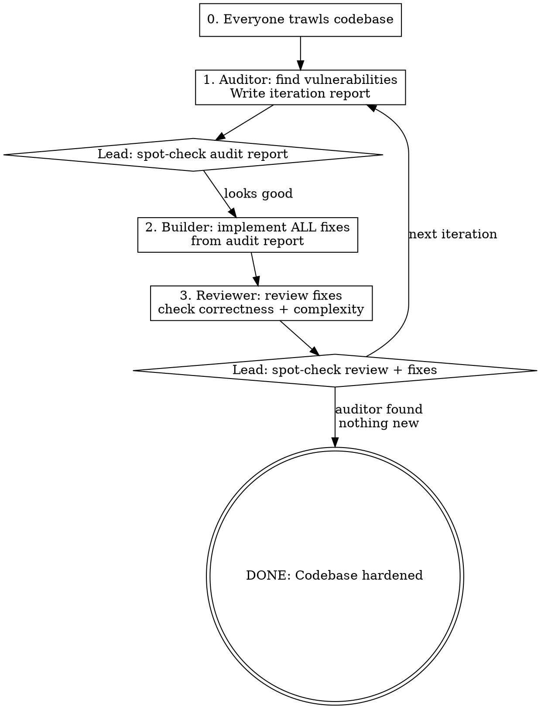

# Security Audit Loop

## Overview

Iterative adversarial security hardening using a 4-agent team: lead (orchestrator), security-auditor, builder, code-reviewer. Loops until the auditor cannot find any more vulnerabilities.

## When to Use

- Hardening a project's security posture before release
- Conducting a thorough white-hat audit of a codebase
- When the user asks for a "ralph loop" or iterative security audit
- Any request to find and fix all vulnerabilities in a project

## Team Shape

| Role | Agent Type | Mode | Purpose |
|------|-----------|------|---------|
| Lead | You (orchestrator) | — | Trawl first, dispatch, spot-check between iterations |
| security-auditor | general-purpose | bypassPermissions | Adversarial white-hat auditor |
| builder | general-purpose | bypassPermissions | Implements fixes from audit reports |
| code-reviewer | general-purpose | bypassPermissions | Reviews fixes, reins in complexity |

## The Loop



**Exit condition:** Auditor runs a full pass and surfaces zero new findings.

## Iteration Artifacts

Save all artifacts in `.agent/ralph_YYYYMMDD_{description}/`:

```
.agent/ralph_20260319_security_audit_and_fix/
  iteration_001_audit.md      # Auditor's findings
  iteration_001_review.md     # Reviewer's notes (if any)
  iteration_002_audit.md      # Next pass
  ...
```

Each step commits its work before handing off to the next agent.

## Auditor Prompt Guidance

The auditor prompt must be adversarial and exhaustive. Cover ALL categories:

- **Network & Transport:** binding, TLS, port exposure, protocol downgrade
- **Authentication & Authorization:** bypass vectors, spoofing, TOCTOU, stale credentials
- **Input Validation:** path traversal, injection (SQL/command/JSON), encoding tricks, null bytes, symlinks
- **Information Disclosure:** error messages, timing attacks, filesystem enumeration
- **Denial of Service:** unbounded reads, missing rate limits, resource exhaustion, blocking calls
- **Client-Side:** credential storage, certificate pinning, SSRF via user input
- **Race Conditions:** concurrent access, double-start, cache invalidation windows
- **Dependencies:** known CVEs, supply chain, command injection through subprocess calls

Report format per finding:
```
### [SEV-CRITICAL/HIGH/MEDIUM/LOW] Title
**Category:** ...
**File(s):** [with line numbers]
**Description:** ...
**Attack Scenario:** [concrete, not vague]
**Recommendation:** [specific fix]
```

## Lead Orchestrator Responsibilities

1. **Trawl first** — read the entire codebase before dispatching anyone
2. **Set up task dependencies** — audit blocks build, build blocks review
3. **Spot-check after audit** — skim the report, make sure findings are real and specific
4. **Spot-check after review** — ensure fixes address the actual vulnerabilities, reviewer isn't rubber-stamping
5. **Create next iteration tasks** — after review completes, set up iteration N+1
6. **Call the exit** — when auditor reports zero findings, the loop is done

## Builder Prompt Guidance

- Read the audit report line by line, fix EVERY finding
- Production-quality code, not patches
- Follow existing project conventions
- Commit with descriptive message referencing the iteration

## Reviewer Prompt Guidance

- Fresh-eyes review of ALL changes in the iteration
- Correctness: does the fix actually close the vulnerability?
- Regressions: does it break anything?
- Complexity: is the solution proportional? Flag over-engineering.
- Holistic: as iterations accumulate, proactively suggest cleanups if code is getting unwieldy

## Common Mistakes

- Auditor being too vague ("could be insecure") — demand concrete attack scenarios
- Builder fixing symptoms not root causes — reviewer should catch this
- Complexity creeping across iterations — reviewer must rein this in
- Lead not spot-checking — bad findings cascade into bad fixes
- Declaring done too early — auditor must genuinely try hard on the final pass
